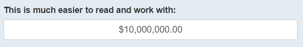
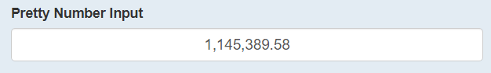
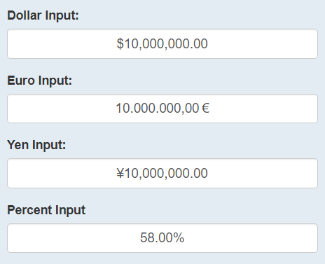
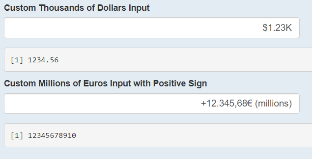

```{r setup, include=FALSE}
knitr::opts_chunk$set(echo = TRUE, warning = FALSE, message = FALSE)
```


As someone who has developed several shiny apps for business use, I worked alot with inputs in the app that were dollar-based.
Specifically, in one revenue planning solution the user was expected to input amounts in the millions and tens of millions repeatedly.
If you have ever tried to do this in a typical `shiny::numericInput()` you will know that trying to keep track of zeros can be tedious.

```{r}
library(shiny)
numericInput(
  inputId = ("num"),
  label = "Try typing a lot of zeros here:",
  value = 10000000,
  width = "25%"
)
```

The business leaders needed a better solution than that, so I dug in and wrote a basic javascript input binding that automatically added a dollar sign and commas.
With the encouragement of my supervisor, I decided to make this avaiable to everyone by submitting a pull request to the `{shinyWidgets}` package.

The author and maintainer of that package, [Victor Perrier](https://github.com/pvictor) suggested a more robust approach using a pre-existing javascript library called [Autonumeric.js](http://autonumeric.org/), and with his help I was able to create a new Autonumeric family of functions in `{shinyWidgets}`.

With these new functions, we can transform the above input, into something like this (note that `{shinyWidgets}` inputs depend on an active shiny session, so the outputs of `{shinyWidgets}` code chunks will just be screen-shots):

```{r, eval=FALSE}
library(shinyWidgets)
currencyInput(
  inputId = "auto_num",
  label = "This is much easier to read and work with:",
  format = "dollar",
  value = 10000000,
  width = "50%"
)
```

{width=50%}

Autonumeric inputs provide as-you-type formatting, so you can easily keep track of whether it's \$10,000 or \$10,000,000.
To try it out in action, please visit my [example shiny app]().

## Functions

There are three main functions: `currencyInput()`, `formatNumericInput()`, and `autonumericInput()`.
Each of these functions has an associated `update*()` function.

The first two are pre-packaged for helping with specific formats, such as Euro format, dollar format, percentage format, or even just plain old pretty number format.
`shinyWidgets::currencyInput()` and `shinyWidgets::formatNumericInput()` perform the exact same operations, the only difference is in the naming.
The `format` argument of these functions can be set to one of over 40 presets ([see available list of presets here](https://github.com/autoNumeric/autoNumeric/#predefined-language-options) or [view the documentation](https://rdrr.io/github/dreamRs/shinyWidgets/man/formatNumericInput.html) for either of these functions for an abbreviated list).
Since these formats can be for percentages, currencies, or numbers we created the two different functions for easier code readability (it wouldn't make a lot of sense to have `currencyInput()` output a percentage input in my opinion).

The last function, `autonumericInput()` is a complete wrapper of the Autonumeric javascript library, which comes with over 55 parameters.
The most useful have been included as specific function parameters, and all others can be passed to `...`.
Extensive documentation of the parameters can be found [in the `R` package itself](https://rdrr.io/github/dreamRs/shinyWidgets/man/autonumericInput.html) and also on the [Autonumeric website](http://autonumeric.org/guide).

The update functions for the three main functions provide the same update functionality common to all shiny inputs.

## Examples

We will explore some basic use cases here and the code will be shown, but for an interactive version of these examples see [this online shiny app]().

First, we will just call the input with the American number format:
```{r, eval=FALSE}
formatNumericInput(
  inputId = "pct",
  label = "Pretty Number Input",
  value = 1145389.58,
  width = "50%",
  format = "dotDecimalCharCommaSeparator"
)
```

{width=50%}


Then, we can test some of the other presets:
```{r, eval=FALSE}
## A Dollar Input
currencyInput(
  inputId = "dollar",
  label = "Dollar Input:",
  format = "dollar",
  value = 10000000,
  width = "50%"
)

## A Euro Input
currencyInput(
  inputId = "euro",
  label = "Euro Input:",
  format = "euro",
  value = 10000000,
  width = "50%"
)

## A Yen Input
currencyInput(
  inputId = "yen",
  label = "Yen Input:",
  format = "Japanese",
  value = 10000000,
  width = "50%"
)

## A Percent Input
formatNumericInput(
  inputId = "pct",
  label = "Percent Input",
  format = "percentageUS2dec",
  value = .58,
  width = "50%"
)
```

{width=50%}

Finally, we can get really creative and create some custom currency inputs:
```{r, eval=FALSE}
## Add a K and divide by 1000 when not unfocused
autonumericInput(
  inputId = "id2",
  label = "Custom Thousands of Dollars Input",
  value = 1234.56,
  align = "right",
  currencySymbol = "$",
  currencySymbolPlacement = "p",
  decimalCharacter = ".",
  digitGroupSeparator = ",",
  divisorWhenUnfocused = 1000,
  symbolWhenUnfocused = "K",
  width = "50%"
)

## Add a (millions) and divide by 1,000,000 when unfocused
autonumericInput(
  inputId = "id3",
  label = "Custom Millions of Euros Input with Positive Sign",
  value = 12345678910,
  align = "right",
  currencySymbol = "\u20ac",
  currencySymbolPlacement = "s",
  decimalCharacter = ",",
  digitGroupSeparator = ".",
  divisorWhenUnfocused = 1000000,
  symbolWhenUnfocused = " (millions)",
  showPositiveSign = TRUE,
  width = "50%"
)
```

{width=50%}

## Conclusion

The Autonumeric library is extremely powerful and is now available to use in shiny applications in R.
With it, shiny applications can more easily be used in business settings where monetary and percent inputs are common, but its use extends far beyond those areas.
Essentially any kind of number input is at ones fingertips with this tool.


I hope this was helpful and informative.
Don't forget to check out the resources provided here for further guidance, and please reach out with any questions!

## Resources

- [Interactive App:]()
- [shinyWidgets Github:](https://github.com/dreamRs/shinyWidgets) https://github.com/dreamRs/shinyWidgets
- [shinyWidgets Documentation:](https://rdrr.io/github/dreamRs/shinyWidgets/man/autonumericInput.html) https://rdrr.io/github/dreamRs/shinyWidgets/man/autonumericInput.html
- [Autonumeric Web site:](http://autonumeric.org/) http://autonumeric.org/
- [Autonumeric Github:](https://github.com/autoNumeric/autoNumeric) https://github.com/autoNumeric/autoNumeric

